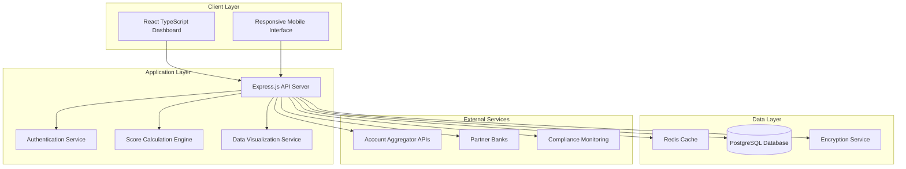

# Design Document: TrustBridge Alternative Credit Scoring Platform

## Overview

TrustBridge is a web-based fintech platform that leverages the RBI Account Aggregator (AA) framework to generate alternative credit scores for users without traditional credit history. The platform analyzes cash flow patterns, investment behavior, and payment consistency to create a comprehensive creditworthiness assessment that banks can trust.

The system operates as a Financial Information User (FIU) under RBI guidelines, ensuring regulatory compliance while providing a secure, consent-based data sharing experience. The platform targets Gen Z, first-time job seekers, freelancers, and small business owners who are financially underserved but tech-savvy.

## Architecture

### High-Level Architecture



### Technology Stack

**Frontend:**
- React 18 with TypeScript for type safety and maintainability
- Tailwind CSS for consistent design system implementation
- Chart.js/D3.js for interactive data visualizations
- React Query for efficient data fetching and caching
- React Router for client-side navigation

**Backend:**
- Node.js with Express.js for API server
- TypeScript for type safety across the stack
- JWT for secure authentication and session management
- Helmet.js for security headers and protection
- Rate limiting middleware for API protection

**Database & Storage:**
- PostgreSQL for structured data storage with ACID compliance
- Redis for session management and caching
- AES-256 encryption for sensitive data at rest
- TLS 1.3 for data in transit

**Infrastructure:**
- Docker containers for consistent deployment
- HTTPS/TLS enforcement with HSTS headers
- API rate limiting and DDoS protection
- Automated security scanning and vulnerability assessment

## Components and Interfaces

### Frontend Components

#### 1. Layout Components

**Sidebar Navigation (`SidebarNav`)**
- Fixed left sidebar with logo, navigation menu, and compliance badge
- Responsive collapse to hamburger menu on mobile devices
- Active state highlighting for current section
- Trust badge display at bottom with RBI compliance indicator

**Main Content Area (`ContentArea`)**
- Scrollable content container with proper spacing
- Responsive grid system for different screen sizes
- Consistent padding and margin following design system

#### 2. Dashboard Components

**Hero Section (`HeroSection`)**
- Primary headline with value proposition
- Dual call-to-action buttons (primary and secondary)
- Split composition visual showing traditional vs alternative scoring

**Trust Ticker (`TrustTicker`)**
- Horizontal strip displaying security and compliance indicators
- Icons with accompanying text for key trust signals
- Animated scroll or fade-in effects for engagement

**Data Visualizer (`ScoreComparison`)**
- Interactive comparison chart showing traditional vs alternative scores
- Tooltip system for transaction event annotations
- Real-time updates as new data becomes available
- Responsive design for mobile viewing

**Process Flow (`HowItWorks`)**
- Three-card layout explaining the connection process
- Icon-based visual representation of each step
- Clear, concise explanations of each phase

#### 3. Functional Components

**Account Connection (`AccountConnector`)**
- OTP-based authentication interface
- Multi-account selection and consent management
- Progress indicators for connection status
- Error handling and retry mechanisms

**Score Display (`ScoreCard`)**
- Primary score visualization with growth indicators
- Breakdown of contributing factors
- Historical trend analysis
- Comparison with traditional scoring methods

### Backend Services

#### 1. Authentication Service

**JWT Token Management**
- Secure token generation and validation
- Refresh token rotation for enhanced security
- Session management with Redis storage
- Multi-factor authentication support

**AA Framework Integration**
- OAuth 2.0 flow implementation for account connections
- Consent management and tracking
- Token exchange with financial institutions
- Secure credential handling without storage

#### 2. Score Calculation Engine

**Cash Flow Analysis**
- Income stability assessment using salary credit patterns
- Expense categorization and spending behavior analysis
- Savings rate calculation and trend analysis
- Investment contribution tracking and consistency scoring

**Risk Assessment Model**
- Machine learning model for creditworthiness evaluation
- Feature engineering from transaction data
- Real-time score updates based on new data
- Explainable AI for score factor breakdown

**Data Processing Pipeline**
- Secure data ingestion from AA framework
- Data validation and sanitization
- Feature extraction and transformation
- Score calculation and storage

#### 3. Data Visualization Service

**Chart Data Generation**
- Time-series data preparation for score trends
- Comparison data formatting for traditional vs alternative scores
- Transaction event annotation for tooltip display
- Real-time data streaming for live updates

**Export and Reporting**
- PDF report generation for loan applications
- Data export functionality for user records
- Compliance reporting for regulatory requirements
- Audit trail generation for data access

## Data Models

### User Data Model

```typescript
interface User {
  id: string;
  email: string;
  phone: string;
  createdAt: Date;
  updatedAt: Date;
  kycStatus: 'pending' | 'verified' | 'rejected';
  consentStatus: 'active' | 'revoked' | 'expired';
  lastLoginAt: Date;
}
```

### Account Connection Model

```typescript
interface AccountConnection {
  id: string;
  userId: string;
  institutionId: string;
  institutionName: string;
  accountType: 'savings' | 'current' | 'investment' | 'credit';
  connectionStatus: 'active' | 'inactive' | 'error';
  lastSyncAt: Date;
  consentExpiryAt: Date;
  encryptedTokens: string; // Encrypted AA tokens
}
```

### Transaction Data Model

```typescript
interface Transaction {
  id: string;
  accountId: string;
  amount: number;
  type: 'credit' | 'debit';
  category: string;
  description: string;
  transactionDate: Date;
  balance: number;
  merchantInfo?: string;
  isRecurring: boolean;
}
```

### Credit Score Model

```typescript
interface CreditScore {
  id: string;
  userId: string;
  score: number; // 300-850 range
  scoreDate: Date;
  factors: ScoreFactor[];
  confidence: number; // 0-1 range
  traditionalScore?: number; // null for users without credit history
  trend: 'improving' | 'stable' | 'declining';
}

interface ScoreFactor {
  category: 'income_stability' | 'savings_rate' | 'payment_behavior' | 'investment_activity';
  impact: number; // -100 to +100
  description: string;
  weight: number; // 0-1 range
}
```

### Loan Eligibility Model

```typescript
interface LoanEligibility {
  id: string;
  userId: string;
  isEligible: boolean;
  maxLoanAmount: number;
  recommendedAmount: number;
  interestRateRange: {
    min: number;
    max: number;
  };
  eligibilityFactors: string[];
  partnerOffers: PartnerOffer[];
  calculatedAt: Date;
}

interface PartnerOffer {
  bankId: string;
  bankName: string;
  loanAmount: number;
  interestRate: number;
  tenure: number;
  processingFee: number;
  offerValidUntil: Date;
}
```

## Correctness Properties

*A property is a characteristic or behavior that should hold true across all valid executions of a system—essentially, a formal statement about what the system should do. Properties serve as the bridge between human-readable specifications and machine-verifiable correctness guarantees.*

<function_calls>
<invoke name="prework">
<parameter name="featureName">trustbridge-platform

### Property Reflection

After reviewing all properties identified in the prework analysis, I've identified several areas where properties can be consolidated to eliminate redundancy:

- Properties 3.2 and 3.3 (visualization requirements) can be combined into a comprehensive visualization property
- Properties 4.2 and 4.3 (UI state and styling) can be consolidated into a single UI consistency property  
- Properties 6.4 and 6.5 (loan offer display and comparison) can be combined into a comprehensive loan offer property
- Properties 7.1, 7.2, 7.3, 7.4, 7.5 (educational content) can be consolidated into a single content completeness property

The following properties provide unique validation value and will be retained as separate properties.

### Correctness Properties

Property 1: OTP Authentication Without Credential Storage
*For any* user attempting to connect any valid financial account, the OTP authentication process should complete successfully without storing user credentials locally in the system
**Validates: Requirements 1.1**

Property 2: Individual Consent for Multiple Accounts
*For any* set of financial accounts being connected by a user, each account connection should trigger a separate, explicit consent request
**Validates: Requirements 1.2**

Property 3: Consistent Error Handling for Authentication Failures
*For any* authentication failure during account connection, the system should provide clear error messages and functional retry options
**Validates: Requirements 1.3**

Property 4: Comprehensive Score Factor Analysis
*For any* valid bank statement data containing salary credits, investments, and bill payments, the alternative score calculation should include all specified factors in the final score
**Validates: Requirements 2.1**

Property 5: Insufficient Data Handling
*For any* user dataset below the minimum threshold for score calculation, the system should request additional account connections or extended time periods
**Validates: Requirements 2.3**

Property 6: Automatic Score Updates
*For any* user profile, adding new transaction data should trigger automatic score recalculation and update the stored score
**Validates: Requirements 2.4**

Property 7: Score Breakdown Completeness
*For any* completed score calculation, the result should include a detailed breakdown of all contributing factors with their respective impacts
**Validates: Requirements 2.5**

Property 8: Traditional Score Visualization for Credit-Thin Users
*For any* user without existing credit history, the data visualizer should display the traditional score as a flat line at zero
**Validates: Requirements 3.1**

Property 9: Comprehensive Alternative Score Visualization
*For any* alternative score data, the visualization should display both a growth curve and annotated transaction events with interactive tooltips explaining score contributors
**Validates: Requirements 3.2, 3.3**

Property 10: Real-time Visualization Updates
*For any* user profile, when new financial data is processed, the data visualizer should update in real-time and highlight specific factors causing score changes
**Validates: Requirements 3.4, 3.5**

Property 11: UI Navigation State Management
*For any* navigation action within the dashboard, the sidebar should maintain proper state, highlight the active section, and use the specified color scheme (deep slate blue for primary elements, emerald green for score-related components)
**Validates: Requirements 4.2, 4.3**

Property 12: Responsive Design Behavior
*For any* viewport size at mobile breakpoints, the dashboard should collapse the sidebar into a hamburger menu while maintaining full functionality
**Validates: Requirements 4.5**

Property 13: Loan Eligibility Display
*For any* alternative score that meets or exceeds the eligibility threshold, the system should display loan eligibility status with transparent terms and comparison capabilities for multiple partner offers
**Validates: Requirements 6.1, 6.4, 6.5**

Property 14: Audit Trail Generation
*For any* data access or processing operation, the system should create appropriate audit records with timestamps, user identification, and operation details
**Validates: Requirements 8.3**

Property 15: Consent Revocation Response
*For any* user consent revocation action, the system should immediately terminate data access and purge all stored information related to that consent
**Validates: Requirements 8.4**

## Error Handling

### Authentication Errors

**OTP Failures**
- Invalid OTP codes should trigger clear error messages with retry options
- Expired OTP sessions should prompt for new OTP generation
- Maximum retry attempts should be enforced to prevent brute force attacks
- Account lockout mechanisms for repeated failures

**Account Connection Errors**
- Network timeouts should be handled gracefully with retry mechanisms
- Invalid account credentials should provide helpful error guidance
- Institution-specific errors should be translated to user-friendly messages
- Partial connection failures should allow retry of failed accounts only

### Data Processing Errors

**Insufficient Data Scenarios**
- Missing transaction categories should not break score calculation
- Incomplete account histories should trigger data sufficiency warnings
- Corrupted transaction data should be flagged and excluded from calculations
- Zero-balance accounts should be handled without affecting score validity

**Score Calculation Failures**
- Mathematical errors in scoring algorithms should be logged and reported
- Missing required data fields should trigger graceful degradation
- External service failures should not prevent basic score display
- Cache misses should fall back to database queries

### UI/UX Error States

**Loading States**
- Long-running operations should display progress indicators
- Failed data loads should show retry options
- Partial data loads should indicate incomplete information
- Network connectivity issues should be clearly communicated

**Validation Errors**
- Form input errors should be highlighted with specific guidance
- File upload failures should provide clear error descriptions
- Data format errors should suggest correct formats
- Required field validation should be immediate and helpful

## Testing Strategy

### Dual Testing Approach

The TrustBridge platform will employ both unit testing and property-based testing to ensure comprehensive coverage and correctness validation.

**Unit Tests** will focus on:
- Specific examples demonstrating correct behavior
- Edge cases and error conditions
- Integration points between components
- Regulatory compliance scenarios
- Security boundary validation

**Property-Based Tests** will focus on:
- Universal properties that hold across all inputs
- Comprehensive input coverage through randomization
- Correctness properties defined in this design document
- Data integrity across different user scenarios
- System behavior under various load conditions

### Property-Based Testing Configuration

**Testing Framework**: We will use `fast-check` for TypeScript/JavaScript property-based testing, which provides excellent integration with Jest and comprehensive data generation capabilities.

**Test Configuration**:
- Minimum 100 iterations per property test to ensure statistical significance
- Each property test must reference its corresponding design document property
- Tag format: **Feature: trustbridge-platform, Property {number}: {property_text}**
- Custom generators for financial data, user profiles, and transaction patterns

**Example Property Test Structure**:
```typescript
// Feature: trustbridge-platform, Property 4: Comprehensive Score Factor Analysis
test('score calculation includes all specified factors', () => {
  fc.assert(fc.property(
    bankStatementGenerator(),
    (bankStatement) => {
      const score = calculateAlternativeScore(bankStatement);
      expect(score.factors).toIncludeFactors(['salary_credits', 'investments', 'bill_payments']);
    }
  ), { numRuns: 100 });
});
```

### Unit Testing Strategy

**Component Testing**:
- React component rendering with various props
- User interaction handling (clicks, form submissions)
- State management and data flow
- Responsive design behavior

**Service Testing**:
- API endpoint functionality
- Database operations and data integrity
- External service integration
- Authentication and authorization flows

**Security Testing**:
- Input sanitization and validation
- SQL injection prevention
- XSS attack prevention
- CSRF protection mechanisms

### Integration Testing

**End-to-End Scenarios**:
- Complete user onboarding flow
- Account connection and data synchronization
- Score calculation and visualization
- Loan eligibility and offer generation

**API Integration**:
- Account Aggregator framework integration
- Partner bank API interactions
- Real-time data synchronization
- Error handling across service boundaries

### Performance Testing

**Load Testing**:
- Concurrent user sessions
- Database query performance
- API response times under load
- Memory usage and garbage collection

**Security Performance**:
- Encryption/decryption overhead
- Authentication token validation speed
- Rate limiting effectiveness
- DDoS protection mechanisms

### Compliance Testing

**Regulatory Validation**:
- RBI AA framework compliance
- Data retention policy enforcement
- Consent management workflows
- Audit trail completeness and accuracy

**Privacy Testing**:
- Data anonymization effectiveness
- Consent revocation completeness
- Cross-border data transfer restrictions
- GDPR-equivalent privacy protections

This comprehensive testing strategy ensures that the TrustBridge platform meets both functional requirements and regulatory compliance standards while maintaining high performance and security standards.